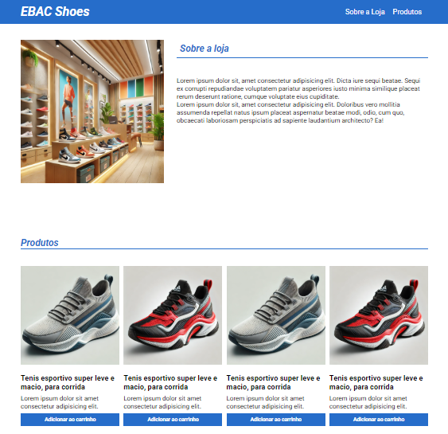

### CSS Responsivo Atividade

## Requisitos

- Criar um layout responsivo de uma loja virtual;

- Criar uma seção “sobre a loja”, nesta seção teremos duas colunas uma com a imagem da loja e outra com um texto;

- Criar uma seção de produtos onde haverá uma listagem de 4 produtos, lado a lado, com a imagem, nome e descrição do produto e um botão para adicionar ao carrinho;

## Sobre

- O site esta disponivel para dispositivos moveis sendo responsivo a tablet e celulares

##

Clique para ver 👇

    <a href="https://ebac-modulo-css-responsivo-atividade.vercel.app/">
        </img>
    </a>

